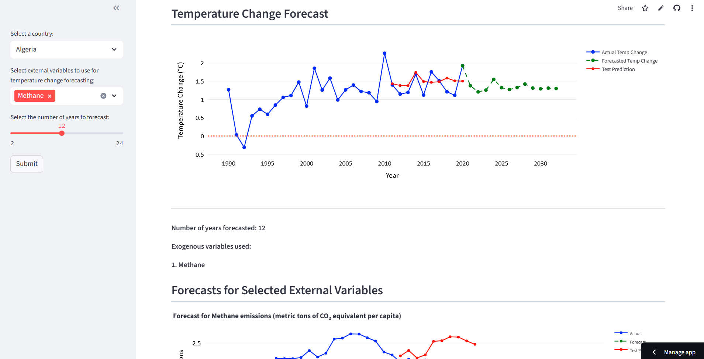

# Temperature Change Forecast

Forecasting temperature change using SARIMAX model and external variables like carbon dioxide, methane, and nitrous oxide.

In the streamlit interface, user can select the country from the dropdown and choose one or more external variables to be used as exogenous variables for forecasting (or none at all). Finally, they can choose the number of years to forecast. This then gives an interactive graph showing the forecast. If any exogenous variables were chosen, their forecasts are also shown (which was used for the final temperature forecast). 

Streamlit UI:

